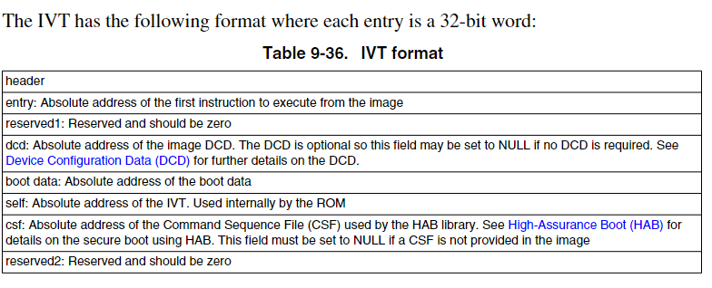
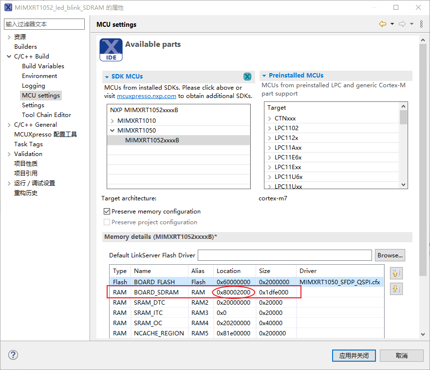
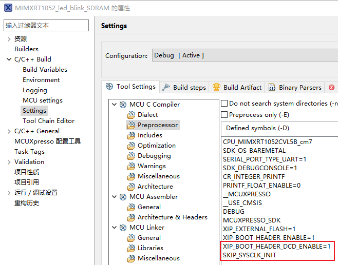
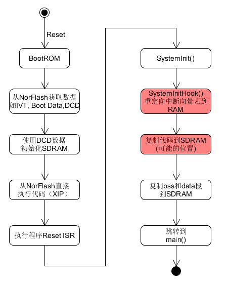

### 从QSPI Nor Flash启动并加载程序到外部SDRAM中运行

本工程基于野火“I.MX1052 EVK Pro”开发板。

由于代码最终是被下载到Nor Flash中的，所有需要让BootROM代码从Nor Flash中获取IVT(image vector table), Boot Data以及DCD(Device Configuration Data)配置信息。


因为要使程序加载到外部SDRAM，则需要首先初始化SDRAM，DCD即可用来使BootROM配置SDRAM。



> 参考 IMXRT1050 Reference Manual.pdf 的9.7 Program image章

#### XIP相关配置

修改工程下xip目录下的`evkbimxrt1050_flexspi_nor_config.c`，本工程开发板使用的Nor Flash型号为W25Q256JV，根据其数据手册做如下修改。

```c
const flexspi_nor_config_t spiflash_config = {
    .memConfig =
        {
            .tag                = FLEXSPI_CFG_BLK_TAG,      //  ASCII: 'FCFB'

            // [31:24]: ASCII 'V', [23:16]: major = 1, [15:8]: minor = 4, [7:0]: bugfix = 0
            .version            = FLEXSPI_CFG_BLK_VERSION,

            .readSampleClkSrc   = kFlexSPIReadSampleClk_LoopbackInternally,
            .csHoldTime         = 3u, // Serial Flash CS Hold Time Recommend default value is 0x03
            .csSetupTime        = 3u, // Serial Flash CS Setup Time Recommend default value is 0x03
            .columnAddressWidth = 0u, // 3 - For HyperFlash, 12/13 - For Serial NAND, 0 - Other devices
            .deviceModeCfgEnable= 1u,

            .deviceModeType = 1u, // Quad Enable

            // Wait time for all configuration commands, unit 100us
            // If it is greater than 0, ROM will wait (waitTimeCfgCommands * 100us)
            // for all device memory configuration commands instead of using read
            // status to wait until these commands complete.
            .waitTimeCfgCommands = 0, // Available for device that support v1.1.0 FlexSPI configuration block

            // Set QE bit at Status Register of Nor Flash
            // Now configure NOR flash SPI mode use specified LUT sequence
            .deviceModeSeq.seqNum   = 1, // Bit[7:0] - number of LUT sequences for Device mode configuration command
            .deviceModeSeq.seqId    = 2, // Bit[15:8] - starting LUT index of Device mode configuration command
            .deviceModeSeq.reserved = 0, // Bit[31:16] - must be 0
            // [31:24] = xx (unused); [23:0] = S23:S0 (Status Register 3/2/1, S9 is Quad Enable bit)
            .deviceModeArg          = 0x00000200, // Device Mode argument, effective only when `deviceModeCfgEnable = 1`

            .controllerMiscOption   = 0, // For DDR, now unused

            .deviceType    = kFlexSpiDeviceType_SerialNOR, // 1 - Serial NOR Flash; 2 - Serial NAND Flash
            .sflashPadType = kSerialFlash_4Pads,           // 4 Pin for SPI Data (Quad SPI)
            .serialClkFreq = kFlexSpiSerialClk_133MHz,

            // 0 - Use pre-defined LUT sequence index and number
            // 1 - Use LUT sequence parameters provided in this block
            .lutCustomSeqEnable   = 0,

            // For SPI NOR, need to fill with actual size;
            // For SPI NAND, need to fill with actual size * 2
            .sflashA1Size  = 32u * 1024u * 1024u,

            .busyOffset      = 0, // busy bit offset, valid range :0-31
            .busyBitPolarity = 0, // 0 - busy bit is 1 if device is busy

            .lookupTable =
            {
                 // 0th Seq: Fast Read Quad I/O  with 4-Byte Address
                 [4 * CMD_LUT_SEQ_IDX_READ + 0] = FLEXSPI_LUT_SEQ(CMD_SDR,   FLEXSPI_1PAD, 0xEC, RADDR_SDR, FLEXSPI_4PAD, 0x20),
                 [4 * CMD_LUT_SEQ_IDX_READ + 1] = FLEXSPI_LUT_SEQ(MODE8_SDR, FLEXSPI_4PAD, 0xFF, DUMMY_SDR, FLEXSPI_4PAD, 0x04),
                 [4 * CMD_LUT_SEQ_IDX_READ + 2] = FLEXSPI_LUT_SEQ(READ_SDR,  FLEXSPI_4PAD, 0x01, STOP,      FLEXSPI_1PAD, 0x00),
                 [4 * CMD_LUT_SEQ_IDX_READ + 3] = 0,

                 // 1th Seq: Read Status Register 1
                 [4 * CMD_LUT_SEQ_IDX_READSTATUS + 0] = FLEXSPI_LUT_SEQ(CMD_SDR, FLEXSPI_1PAD, 0x05, READ_SDR, FLEXSPI_1PAD, 0x01),

                 // 2th Seq: Write Status Register 2
                 [4 * 2 + 0] = FLEXSPI_LUT_SEQ(CMD_SDR, FLEXSPI_1PAD, 0x31, WRITE_SDR, FLEXSPI_1PAD, 0x01),

                 // 3th Seq: Write Enable
                 [4 * CMD_LUT_SEQ_IDX_WRITEENABLE + 0] = FLEXSPI_LUT_SEQ(CMD_SDR, FLEXSPI_1PAD, 0x06, STOP, FLEXSPI_1PAD, 0x00),

                 // 5th Seq: Sector Erase with 4-Bytes Address
                 [4 * NOR_CMD_LUT_SEQ_IDX_ERASESECTOR + 0] = FLEXSPI_LUT_SEQ(CMD_SDR, FLEXSPI_1PAD, 0x21, RADDR_SDR, FLEXSPI_1PAD, 0x20),

                 // 9th Seq: Qaud Page Program with 4-Bytes Address
                 [4 * CMD_LUT_SEQ_IDX_WRITE + 0] = FLEXSPI_LUT_SEQ(CMD_SDR,     FLEXSPI_1PAD, 0x34, RADDR_SDR, FLEXSPI_4PAD, 0x20),
                 [4 * CMD_LUT_SEQ_IDX_WRITE + 1] = FLEXSPI_LUT_SEQ(WRITE_SDR,   FLEXSPI_4PAD, 0x01, STOP,      FLEXSPI_1PAD, 0x00),

                 // 11th Seq: Chip Erase
                 [4 * NOR_CMD_LUT_SEQ_IDX_CHIPERASE + 0] = FLEXSPI_LUT_SEQ(CMD_SDR, FLEXSPI_1PAD, 0xC7, STOP, FLEXSPI_1PAD, 0x00),
            },

            .lutCustomSeq = {{0}},
        },
    .pageSize           = 256u,
    .sectorSize         = 4u * 1024u,
    .blockSize          = 64u * 1024u,
    .ipcmdSerialClkFreq = 0, // 0 - No change, keep current serial clock unchanged
//    .isCmdSerialClkFreq = kFlexSpiSerialClk_133MHz,
};
```

做完此修改后，应该就可以实现XIP运行了。

#### 配置SDRAM作为链接脚本的主要RAM

R5RT1052的外部 **SDRAM** 被映射到从 0x80000000 开始的地址，本工程配置从 0x80002000开始，用于存放从Flash中加载的代码，以及存放数据。

#### 加载到SDRAM

要使代码加载到SDRAM，需要实现对应型号的SDRAM的DCD配置数据，本工程开发板使用的SDRAM型号为W9825G6KH，其DCD配置数据如下。

```c
const uint8_t dcd_data[] = {
    /* HEADER */
    /* Tag(1B), Image Length(2B), Version(1B) */
    DCD_TAG_HEADER, 0x04, 0x30, DCD_VERSION,
    /* Write data command Tag(1B), Data Length(2B, include write data command Tag and Header), parameter(1B) */
    0xCC, 0x03, 0xAC, 0x04,
    /* Address(4B), Value/Mask(4B) */
    0x40, 0x0F, 0xC0, 0x68, 0xFF, 0xFF, 0xFF, 0xFF,
    /*0010*/ 0x40, 0x0F, 0xC0, 0x6C, 0xFF, 0xFF, 0xFF, 0xFF, 0x40, 0x0F, 0xC0, 0x70, 0xFF, 0xFF, 0xFF, 0xFF,
    /*0020*/ 0x40, 0x0F, 0xC0, 0x74, 0xFF, 0xFF, 0xFF, 0xFF, 0x40, 0x0F, 0xC0, 0x78, 0xFF, 0xFF, 0xFF, 0xFF,
    /*0030*/ 0x40, 0x0F, 0xC0, 0x7C, 0xFF, 0xFF, 0xFF, 0xFF, 0x40, 0x0F, 0xC0, 0x80, 0xFF, 0xFF, 0xFF, 0xFF,
    /*0040*/ 0x40, 0x0D, 0x80, 0x30, 0x00, 0x00, 0x20, 0x01, 0x40, 0x0D, 0x81, 0x00, 0x00, 0x1D, 0x00, 0x00,
    /*0050*/ 0x40, 0x0F, 0xC0, 0x14, 0x00, 0x01, 0x0D, 0x40, 0x40, 0x1F, 0x80, 0x14, 0x00, 0x00, 0x00, 0x00,
    /*0060*/ 0x40, 0x1F, 0x80, 0x18, 0x00, 0x00, 0x00, 0x00, 0x40, 0x1F, 0x80, 0x1C, 0x00, 0x00, 0x00, 0x00,
    /*0070*/ 0x40, 0x1F, 0x80, 0x20, 0x00, 0x00, 0x00, 0x00, 0x40, 0x1F, 0x80, 0x24, 0x00, 0x00, 0x00, 0x00,
    /*0080*/ 0x40, 0x1F, 0x80, 0x28, 0x00, 0x00, 0x00, 0x00, 0x40, 0x1F, 0x80, 0x2C, 0x00, 0x00, 0x00, 0x00,
    /*0090*/ 0x40, 0x1F, 0x80, 0x30, 0x00, 0x00, 0x00, 0x00, 0x40, 0x1F, 0x80, 0x34, 0x00, 0x00, 0x00, 0x00,
    /*00a0*/ 0x40, 0x1F, 0x80, 0x38, 0x00, 0x00, 0x00, 0x00, 0x40, 0x1F, 0x80, 0x3C, 0x00, 0x00, 0x00, 0x00,
    /*00b0*/ 0x40, 0x1F, 0x80, 0x40, 0x00, 0x00, 0x00, 0x00, 0x40, 0x1F, 0x80, 0x44, 0x00, 0x00, 0x00, 0x00,
    /*00c0*/ 0x40, 0x1F, 0x80, 0x48, 0x00, 0x00, 0x00, 0x00, 0x40, 0x1F, 0x80, 0x4C, 0x00, 0x00, 0x00, 0x00,
    /*00d0*/ 0x40, 0x1F, 0x80, 0x50, 0x00, 0x00, 0x00, 0x00, 0x40, 0x1F, 0x80, 0x54, 0x00, 0x00, 0x00, 0x00,
    /*00e0*/ 0x40, 0x1F, 0x80, 0x58, 0x00, 0x00, 0x00, 0x00, 0x40, 0x1F, 0x80, 0x5C, 0x00, 0x00, 0x00, 0x00,
    /*00f0*/ 0x40, 0x1F, 0x80, 0x60, 0x00, 0x00, 0x00, 0x00, 0x40, 0x1F, 0x80, 0x64, 0x00, 0x00, 0x00, 0x00,
    /*0100*/ 0x40, 0x1F, 0x80, 0x68, 0x00, 0x00, 0x00, 0x00, 0x40, 0x1F, 0x80, 0x6C, 0x00, 0x00, 0x00, 0x00,
    /*0110*/ 0x40, 0x1F, 0x80, 0x70, 0x00, 0x00, 0x00, 0x00, 0x40, 0x1F, 0x80, 0x74, 0x00, 0x00, 0x00, 0x00,
    /*0120*/ 0x40, 0x1F, 0x80, 0x78, 0x00, 0x00, 0x00, 0x00, 0x40, 0x1F, 0x80, 0x7C, 0x00, 0x00, 0x00, 0x00,
    /*0130*/ 0x40, 0x1F, 0x80, 0x80, 0x00, 0x00, 0x00, 0x00, 0x40, 0x1F, 0x80, 0x84, 0x00, 0x00, 0x00, 0x00,
    /*0140*/ 0x40, 0x1F, 0x80, 0x88, 0x00, 0x00, 0x00, 0x00, 0x40, 0x1F, 0x80, 0x8C, 0x00, 0x00, 0x00, 0x00,
    /*0150*/ 0x40, 0x1F, 0x80, 0x90, 0x00, 0x00, 0x00, 0x00, 0x40, 0x1F, 0x80, 0x94, 0x00, 0x00, 0x00, 0x00,
    /*0160*/ 0x40, 0x1F, 0x80, 0x98, 0x00, 0x00, 0x00, 0x00, 0x40, 0x1F, 0x80, 0x9C, 0x00, 0x00, 0x00, 0x00,
    /*0170*/ 0x40, 0x1F, 0x80, 0xA0, 0x00, 0x00, 0x00, 0x00, 0x40, 0x1F, 0x80, 0xA4, 0x00, 0x00, 0x00, 0x00,
    /*0180*/ 0x40, 0x1F, 0x80, 0xA8, 0x00, 0x00, 0x00, 0x00, 0x40, 0x1F, 0x80, 0xAC, 0x00, 0x00, 0x00, 0x00,
    /*0190*/ 0x40, 0x1F, 0x80, 0xB0, 0x00, 0x00, 0x00, 0x10, 0x40, 0x1F, 0x80, 0xB4, 0x00, 0x00, 0x00, 0x00,
    /*01a0*/ 0x40, 0x1F, 0x80, 0xB8, 0x00, 0x00, 0x00, 0x00, 0x40, 0x1F, 0x82, 0x04, 0x00, 0x01, 0x10, 0xF9,
    /*01b0*/ 0x40, 0x1F, 0x82, 0x08, 0x00, 0x01, 0x10, 0xF9, 0x40, 0x1F, 0x82, 0x0C, 0x00, 0x01, 0x10, 0xF9,
    /*01c0*/ 0x40, 0x1F, 0x82, 0x10, 0x00, 0x01, 0x10, 0xF9, 0x40, 0x1F, 0x82, 0x14, 0x00, 0x01, 0x10, 0xF9,
    /*01d0*/ 0x40, 0x1F, 0x82, 0x18, 0x00, 0x01, 0x10, 0xF9, 0x40, 0x1F, 0x82, 0x1C, 0x00, 0x01, 0x10, 0xF9,
    /*01e0*/ 0x40, 0x1F, 0x82, 0x20, 0x00, 0x01, 0x10, 0xF9, 0x40, 0x1F, 0x82, 0x24, 0x00, 0x01, 0x10, 0xF9,
    /*01f0*/ 0x40, 0x1F, 0x82, 0x28, 0x00, 0x01, 0x10, 0xF9, 0x40, 0x1F, 0x82, 0x2C, 0x00, 0x01, 0x10, 0xF9,
    /*0200*/ 0x40, 0x1F, 0x82, 0x30, 0x00, 0x01, 0x10, 0xF9, 0x40, 0x1F, 0x82, 0x34, 0x00, 0x01, 0x10, 0xF9,
    /*0210*/ 0x40, 0x1F, 0x82, 0x38, 0x00, 0x01, 0x10, 0xF9, 0x40, 0x1F, 0x82, 0x3C, 0x00, 0x01, 0x10, 0xF9,
    /*0220*/ 0x40, 0x1F, 0x82, 0x40, 0x00, 0x01, 0x10, 0xF9, 0x40, 0x1F, 0x82, 0x44, 0x00, 0x01, 0x10, 0xF9,
    /*0230*/ 0x40, 0x1F, 0x82, 0x48, 0x00, 0x01, 0x10, 0xF9, 0x40, 0x1F, 0x82, 0x4C, 0x00, 0x01, 0x10, 0xF9,
    /*0240*/ 0x40, 0x1F, 0x82, 0x50, 0x00, 0x01, 0x10, 0xF9, 0x40, 0x1F, 0x82, 0x54, 0x00, 0x01, 0x10, 0xF9,
    /*0250*/ 0x40, 0x1F, 0x82, 0x58, 0x00, 0x01, 0x10, 0xF9, 0x40, 0x1F, 0x82, 0x5C, 0x00, 0x01, 0x10, 0xF9,
    /*0260*/ 0x40, 0x1F, 0x82, 0x60, 0x00, 0x01, 0x10, 0xF9, 0x40, 0x1F, 0x82, 0x64, 0x00, 0x01, 0x10, 0xF9,
    /*0270*/ 0x40, 0x1F, 0x82, 0x68, 0x00, 0x01, 0x10, 0xF9, 0x40, 0x1F, 0x82, 0x6C, 0x00, 0x01, 0x10, 0xF9,
    /*0280*/ 0x40, 0x1F, 0x82, 0x70, 0x00, 0x01, 0x10, 0xF9, 0x40, 0x1F, 0x82, 0x74, 0x00, 0x01, 0x10, 0xF9,
    /*0290*/ 0x40, 0x1F, 0x82, 0x78, 0x00, 0x01, 0x10, 0xF9, 0x40, 0x1F, 0x82, 0x7C, 0x00, 0x01, 0x10, 0xF9,
    /*02a0*/ 0x40, 0x1F, 0x82, 0x80, 0x00, 0x01, 0x10, 0xF9, 0x40, 0x1F, 0x82, 0x84, 0x00, 0x01, 0x10, 0xF9,
    /*02b0*/ 0x40, 0x1F, 0x82, 0x88, 0x00, 0x01, 0x10, 0xF9, 0x40, 0x1F, 0x82, 0x8C, 0x00, 0x01, 0x10, 0xF9,
    /*02c0*/ 0x40, 0x1F, 0x82, 0x90, 0x00, 0x01, 0x10, 0xF9, 0x40, 0x1F, 0x82, 0x94, 0x00, 0x01, 0x10, 0xF9,
    /*02d0*/ 0x40, 0x1F, 0x82, 0x98, 0x00, 0x01, 0x10, 0xF9, 0x40, 0x1F, 0x82, 0x9C, 0x00, 0x01, 0x10, 0xF9,
    /*02e0*/ 0x40, 0x1F, 0x82, 0xA0, 0x00, 0x01, 0x10, 0xF9, 0x40, 0x1F, 0x82, 0xA4, 0x00, 0x01, 0x10, 0xF9,
    /*02f0*/ 0x40, 0x1F, 0x82, 0xA8, 0x00, 0x01, 0x10, 0xF9, 0x40, 0x2F, 0x00, 0x00, 0x10, 0x00, 0x00, 0x04,
    /*0300*/ 0x40, 0x2F, 0x00, 0x08, 0x00, 0x03, 0x05, 0x24, 0x40, 0x2F, 0x00, 0x0C, 0x06, 0x03, 0x05, 0x24,
    /*0310*/ 0x40, 0x2F, 0x00, 0x10, 0x80, 0x00, 0x00, 0x1B, 0x40, 0x2F, 0x00, 0x14, 0x82, 0x00, 0x00, 0x1B,
    /*0320*/ 0x40, 0x2F, 0x00, 0x18, 0x84, 0x00, 0x00, 0x1B, 0x40, 0x2F, 0x00, 0x1C, 0x86, 0x00, 0x00, 0x1B,
    /*0330*/ 0x40, 0x2F, 0x00, 0x20, 0x90, 0x00, 0x00, 0x21, 0x40, 0x2F, 0x00, 0x24, 0xA0, 0x00, 0x00, 0x19,
    /*0340*/ 0x40, 0x2F, 0x00, 0x28, 0xA8, 0x00, 0x00, 0x17, 0x40, 0x2F, 0x00, 0x2C, 0xA9, 0x00, 0x00, 0x1B,
    /*0350*/ 0x40, 0x2F, 0x00, 0x30, 0x00, 0x00, 0x00, 0x21, 0x40, 0x2F, 0x00, 0x04, 0x00, 0x00, 0x79, 0xA8,
    /*0360*/ 0x40, 0x2F, 0x00, 0x40, 0x00, 0x00, 0x0F, 0x31, 0x40, 0x2F, 0x00, 0x44, 0x00, 0x65, 0x29, 0x22,
    /*0370*/ 0x40, 0x2F, 0x00, 0x48, 0x00, 0x01, 0x09, 0x20, 0x40, 0x2F, 0x00, 0x4C, 0x50, 0x21, 0x0A, 0x08,
    /*0380*/ 0x40, 0x2F, 0x00, 0x80, 0x00, 0x00, 0x00, 0x21, 0x40, 0x2F, 0x00, 0x84, 0x00, 0x88, 0x88, 0x88,
    /*0390*/ 0x40, 0x2F, 0x00, 0x94, 0x00, 0x00, 0x00, 0x02, 0x40, 0x2F, 0x00, 0x98, 0x00, 0x00, 0x00, 0x00,
    /*03a0*/ 0x40, 0x2F, 0x00, 0x90, 0x80, 0x00, 0x00, 0x00, 0x40, 0x2F, 0x00, 0x9C, 0xA5, 0x5A, 0x00, 0x0F,
    /*03b0*/ 0xCF, 0x00, 0x0C, 0x1C, 0x40, 0x2F, 0x00, 0x3C, 0x00, 0x00, 0x00, 0x01, 0xCC, 0x00, 0x14, 0x04,
    /*03c0*/ 0x40, 0x2F, 0x00, 0x90, 0x80, 0x00, 0x00, 0x00, 0x40, 0x2F, 0x00, 0x9C, 0xA5, 0x5A, 0x00, 0x0C,
    /*03d0*/ 0xCF, 0x00, 0x0C, 0x1C, 0x40, 0x2F, 0x00, 0x3C, 0x00, 0x00, 0x00, 0x01, 0xCC, 0x00, 0x14, 0x04,
    /*03e0*/ 0x40, 0x2F, 0x00, 0x90, 0x80, 0x00, 0x00, 0x00, 0x40, 0x2F, 0x00, 0x9C, 0xA5, 0x5A, 0x00, 0x0C,
    /*03f0*/ 0xCF, 0x00, 0x0C, 0x1C, 0x40, 0x2F, 0x00, 0x3C, 0x00, 0x00, 0x00, 0x01, 0xCC, 0x00, 0x1C, 0x04,
    /*0400*/ 0x40, 0x2F, 0x00, 0xA0, 0x00, 0x00, 0x00, 0x33, 0x40, 0x2F, 0x00, 0x90, 0x80, 0x00, 0x00, 0x00,
    /*0410*/ 0x40, 0x2F, 0x00, 0x9C, 0xA5, 0x5A, 0x00, 0x0A, 0xCF, 0x00, 0x0C, 0x1C, 0x40, 0x2F, 0x00, 0x3C,
    /*0420*/ 0x00, 0x00, 0x00, 0x01, 0xCC, 0x00, 0x0C, 0x04, 0x40, 0x2F, 0x00, 0x4C, 0x50, 0x21, 0x0A, 0x09,
};
```

工程默认没有使用DCD配置，需要在工程属性中添加宏`XIP_BOOT_HEADER_DCD_ENABLE=1`使能DCD配置。



由于上面的DCD数据是用来初始化SDRAM设备的，而初始化SDRAM的过程是由BootROM完成的，在完成SDRAM的初始化后，应该保持其时钟不改变，所以需要添加宏`SKIP_SYSCLK_INIT`用于在程序运行初始化系统时钟时跳过对其时钟的初始化，即其时钟不改变。

到目前为止，已经满足BootROM从Nor Flash中启动，并将代码加载到SDRAM中的条件了，但是此时BootROM并不会这样做（且仍然作为XIP运行），这是因为此时的程序全部被链接在Flash中，要使程序链接到SDRAM中，必须修改**链接脚本**。

#### BootROM是如何将Nor Flash的代码加载到SDRAM的

> 参考 MCUXpresso_IDE_User_Guide.pdf 的 17.15.1 Relocating code from FLASH to RAM 章节的 Relocating majority of an application into RAM

在上面的参考文档章节中，有如下一段话：

**Important Note: The code that performs this relocation is executed early within the reset handler (within startup_xx file). However, there is the potential for other critical functions to be called before this relocation is performed, for example SystemInit() may be called first to perform essential operations such as enabling RAM!**

**Any function that is called before the relocation is performed must not itself be relocated! For the
specific case above**

#### 修改链接脚本

> 参考 MCUXpresso_IDE_User_Guide.pdf 的 17.15.1 Relocating code from FLASH to RAM 章节的 Relocating majority of an application into RAM

在工程中添加名为“linkscripts”的文件夹，并在此文件夹中创建以下3个**FreeMarker Linker Script Template**文件:

- main_text.ldt

- main_rodata.ldt

- main_data.ldt

其内容分别如下。

main_text.ldt：

```c
        *startup_*.o (.text.*)
        *system_*.o (.text.*)
```

main_text.ldt中的内容会使包含在`*startup_*.o`,`*system_*.o`目标文件中的`.text.*`输入section放在`.text`输出section中，用来覆盖MCUXpresso IDE自动生成的链接文件中的`.text`输入section。这意味着只将`*startup_*.o`,`*system_*.o`目标文件中的代码链接到Flash中，而排除其他`*.o`目标文件的代码（即这些代码不会链接到Flash中）。

main_rodata.ldt：

```c
        *startup_*.o (.rodata .rodata.* .constdata .constdata.*)
        *system_*.o (.rodata .rodata.* .constdata .constdata.*)
        . = ALIGN(${text_align});
```

main_rodata.ldt文件的作用与main_text.ldt的相似，其不同的是main_rodata.ldt针对的是**rodata（只读数据）**，而main_text.ldt则针对的是**text（代码）**。

main_data.ldt：

```c
        *(.text*)
        *(.rodata .rodata.* .constdata .constdata.*)
        . = ALIGN(${text_align});
        *(.data*)
```

main_data.ldt则用于将mian_text.ldt中排除的`*.o`目标文件的`.text*`输入section链接到SDRAM中（`.data` section），以及将main_rodata.ldt中排除的`*.o`目标文件的`.rodata .rodata.*`，`.constdata .constdata.*`链接到SDRAM中；并将所有`*.o`目标文件的`.data*`链接到SDRAM中。

添加如上3个文件前后生成的ld链接脚本的区别如下（截取不同部分）。

添加之前MCUXpresso IDE生成的ld：

```c
     /* MAIN TEXT SECTION */
    .text : ALIGN(4)
    {
        FILL(0xff)
        __vectors_start__ = ABSOLUTE(.) ;
        KEEP(*(.isr_vector))
        /* Global Section Table */
        . = ALIGN(4) ;
        __section_table_start = .;
        __data_section_table = .;
        LONG(LOADADDR(.data));
        LONG(    ADDR(.data));
        LONG(  SIZEOF(.data));
        ...省略
        /* End of Global Section Table */

        *(.after_vectors*)

       *(.text*)
       *(.rodata .rodata.* .constdata .constdata.*)
       . = ALIGN(4);
    } > BOARD_FLASH

    ...省略

    /* Main DATA section (SRAM_DTC) */
    .data : ALIGN(4)
    {
       FILL(0xff)
       _data = . ;
       PROVIDE(__start_data_RAM = .) ;
       PROVIDE(__start_data_SRAM_DTC = .) ;
       *(vtable)
       *(.ramfunc*)
       KEEP(*(CodeQuickAccess))
       KEEP(*(DataQuickAccess))
       *(RamFunction)
       *(.data*)
       . = ALIGN(4) ;
       _edata = . ;
       PROVIDE(__end_data_RAM = .) ;
       PROVIDE(__end_data_SRAM_DTC = .) ;
    } > SRAM_DTC AT>BOARD_FLASH
```

添加之后MCUXpresso IDE生成的ld：

```c
     /* MAIN TEXT SECTION */
    .text : ALIGN(4)
    {
        FILL(0xff)
        __vectors_start__ = ABSOLUTE(.) ;
        KEEP(*(.isr_vector))
        /* Global Section Table */
        . = ALIGN(4) ;
        __section_table_start = .;
        __data_section_table = .;
        LONG(LOADADDR(.data));
        LONG(    ADDR(.data));
        LONG(  SIZEOF(.data));
        ...省略
        /* End of Global Section Table */

        *(.after_vectors*)

        *startup_*.o (.text.*)
        *system_*.o (.text.*)
        *startup_*.o (.rodata .rodata.* .constdata .constdata.*)
        *system_*.o (.rodata .rodata.* .constdata .constdata.*)
        . = ALIGN(4);

    } > BOARD_FLASH

    ...省略

    /* Main DATA section (BOARD_SDRAM) */
    .data : ALIGN(4)
    {
       FILL(0xff)
       _data = . ;
       PROVIDE(__start_data_RAM = .) ;
       PROVIDE(__start_data_BOARD_SDRAM = .) ;
       *(vtable)
       *(.ramfunc*)
       KEEP(*(CodeQuickAccess))
       KEEP(*(DataQuickAccess))
       *(RamFunction)
        *(.text*)
        *(.rodata .rodata.* .constdata .constdata.*)
        . = ALIGN(4);
        *(.data*)
       . = ALIGN(4) ;
       _edata = . ;
       PROVIDE(__end_data_RAM = .) ;
       PROVIDE(__end_data_BOARD_SDRAM = .) ;
    } > BOARD_SDRAM AT>BOARD_FLASH
```

现在，本工程的代码即可以实现从Nor Flash启动，并将代码加载到SDRAM中运行了。

但是，从上面的链接脚本可以看到，`.isr_vector`这个section一直被链接在Flash中，而这个`.isr_vector`输入section是用于存放**中断向量表**的，这意味着，即使现在代码能从SDRAM中运行，但中断相关的代码仍然位于Flash中。

#### 重定向中断向量表到SDRAM

重定向中断向量表的代码位于Flash或位于SDRAM中都可以，但其调用位置需要注意：

- 若调用位置是运行在Flash中的代码，那么重定向中断向量表的代码也需要位于Flash中，因为当程序运行在Flash中时，可能表明此时还不能从SDRAM中执行程序；

- 若调用位置是运行在RAM（包括SDRAM）中，那么此时重定向中断向量表的代码放在任何地方应该都是可以的

本工程中，是通过重载`Systeminit`函数中调用的`SystemInitHook`弱函数实现的，其代码如下：

```c
extern uint32_t __Vectors[];
#define INT_VECTOR_ADDRESS ((uint32_t)__Vectors)

__attribute__ ((section(".after_vectors.relocate_ivt")))
void SystemInitHook (void)
{
    unsigned int* int_vector_start = (void *)INT_VECTOR_ADDRESS;
    unsigned int* int_vector_end = &__section_table_start;
    unsigned int* sdram_ivt_start = (void *)0x20000000;

    while (int_vector_start < int_vector_end)
    {
        *sdram_ivt_start++ = *int_vector_start++;
    }

    SCB->VTOR = 0x20000000;
}
```

其中第一行表示将此函数链接到`.after_vectors.relocate_ivt` section，此section在从上一节的链接脚本可以看到，是被链接到Flash中的，即`SystemInitHook`函数是被链接到Flash中的。

`SystemInitHook`函数是将Flash中的`__Vectors[]`中断向量表（在startup_xxx.c中定义）复制到`0x20000000`地址处，此地址在RT1052中被映射为DTCM（Data Tightly Couple Memory）。


